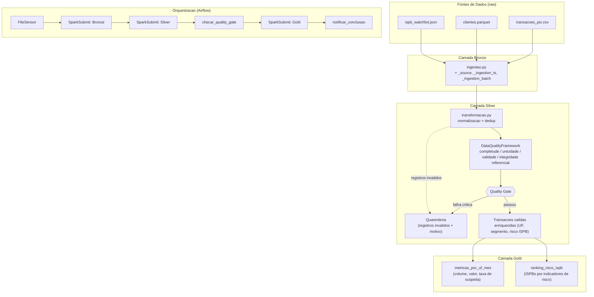

# Arquitetura — GuardianPay: Detecção de Fraude em Transações PIX

## Contexto de negócio

A **GuardianPay** é uma fintech fictícia que processa transações PIX para
seus clientes correntistas. O time de dados precisa identificar padrões
suspeitos (valores muito altos em horários atípicos, transações para
instituições recebedoras de alto risco) e gerar métricas de negócio para
o time de compliance e para a diretoria — sem depender de scripts manuais
que já não escalam com o volume de transações.

Este projeto reproduz, em escala reduzida, o tipo de pipeline que apoia
regras antifraude em ambientes de pagamento instantâneo (PIX Recebidos):
ingestão de múltiplas fontes, enriquecimento com uma watchlist de
instituições (ISPBs), aplicação de regras de qualidade e geração de
indicadores agregados.

> **Nota:** todos os dados (transações, CPFs, ISPBs, nomes) são
> **100% sintéticos**, gerados por `gerar_dados.py`. Nenhum dado real de
> clientes ou de qualquer instituição financeira é utilizado.

## Diagrama do pipeline



## Camadas do Data Lake

| Camada | Conteúdo | Formato | Particionamento |
|---|---|---|---|
| **Bronze** | Dados brutos + metadados de rastreabilidade (`_source`, `_ingestion_ts`, `_ingestion_batch`) | Parquet | `data_ref` |
| **Silver** | Transações normalizadas, deduplicadas, validadas e enriquecidas (UF, segmento do cliente, nível de risco do ISPB) | Parquet | `data_ref` |
| **Quarentena** | Registros que falharam nos checks de qualidade, com `quarentena_motivos` | Parquet | `data_ref` |
| **Gold** | Tabelas agregadas de negócio (ver abaixo) | Parquet | `data_ref` |

## Tabelas Gold

1. **`gold/metricas_por_uf_mes`** — volume de transações, valor total, valor
   médio e taxa de suspeita, agregados por UF e mês. Visão executiva de
   onde o volume (e o risco) está concentrado geograficamente.
2. **`gold/ranking_risco_ispb`** — ranking de instituições recebedoras
   (ISPB) por quantidade de transações suspeitas e taxa de suspeita.
   Usado pelo time de compliance para priorizar investigações.

## Quality Checks implementados (`quality/checks.py`)

Framework próprio (`DataQualityFramework`), sem uso de Great Expectations
ou Soda, com 4 checks:

| Check | Severidade | O que valida |
|---|---|---|
| Completude | critical | % de não-nulos em `cpf_pagador`, `valor`, `timestamp`, `ispb_recebedor` |
| Unicidade | critical | `transacao_id` não duplicado |
| Validade de domínio | critical | valor > 0, CPF com 11 dígitos, ISPB com 8 dígitos, timestamp não-futuro |
| Integridade referencial | warning | `cpf_pagador` existe na base de clientes |

### Showcase — como a quarentena captura um registro inválido

Exemplo real, extraído de uma execução do pipeline sobre os dados
sintéticos (não é dado fictício ilustrativo — é o output verdadeiro de
`data/lake/quarentena/transacoes`):

| transacao_id | cpf_pagador (mascarado) | valor | ispb_recebedor | quarentena_motivos |
|---|---|---|---|---|
| `00120732-...` | 765.***.***-95 | *(nulo)* | 30597066 | `valor_invalido_ou_ausente` |
| `007bd6f3-...` | 111.***.***-05 | -519.62 | 17801635 | `valor_invalido_ou_ausente` |

Nessa execução, de 60.000 transações deduplicadas, **718 (1,2%) foram
para quarentena** — 538 por valor inválido/ausente, 179 por CPF
inválido/ausente, 1 por ambos os motivos simultaneamente. Nenhum desses
registros chega à camada Gold; eles ficam disponíveis em
`data/lake/quarentena/transacoes` com o motivo exato da reprovação, para
auditoria posterior.

> **Nota:** o CPF acima aparece mascarado propositalmente nesta
> documentação (que é versionada em Git e de leitura mais ampla). O
> arquivo Parquet real da quarentena mantém o CPF em texto claro — essa é
> uma decisão de design descrita na seção de LGPD abaixo, não uma
> inconsistência entre o dado e o doc.

> **Nota de nomenclatura:** as chaves das regras de quarentena
> (`quality/checks.py::quarantine`) descrevem o **problema encontrado**
> (`valor_invalido_ou_ausente`), não a condição de sucesso. Numa versão
> anterior deste projeto as chaves eram nomeadas como condição positiva
> (`valor_valido`), o que fazia o relatório reportar `valor_valido` como
> motivo de reprovação de um registro com valor negativo — tecnicamente
> correto (a regra "valor_valido" falhou), mas confuso para quem lê o
> relatório sem abrir o código. Corrigido antes da entrega.

O **quality gate** só bloqueia o avanço para a Gold se algum check
**critical** falhar — checks `warning` geram alerta mas não travam o
pipeline. Registros reprovados vão para a camada de **quarentena**, com o
motivo da reprovação, em vez de serem descartados silenciosamente.

## Decisões de engenharia (e por que não são "atalhos")

### Parquet + SQLite em vez de Delta Lake + Postgres

Esta é uma decisão consciente de **gestão de recursos para ambiente
local**, não uma limitação por falta de conhecimento das alternativas:

- O projeto tem restrição explícita de **8GB de RAM / 4 cores** (a mesma
  do ambiente de laboratório do curso) e deve subir com `docker compose up`
  sem serviços externos pagos.
- **Postgres** exigiria mais um container rodando continuamente só para
  metadados do Airflow — overhead de RAM que compete diretamente com
  Spark (o componente que efetivamente processa os dados). O
  `SequentialExecutor` do Airflow com **SQLite** é suficiente para o
  volume e a frequência (1 execução/dia) deste projeto, e é a mesma
  configuração usada em `shared/docker-compose.full.yml` do curso.
- **Delta Lake** adiciona valor real em cenários com necessidade de
  `MERGE`/upsert, viagem no tempo e transações ACID entre múltiplos
  escritores concorrentes. Aqui a escrita é sempre de um único job Spark
  por vez, com `mode("overwrite")` particionado por `data_ref` — o que já
  garante idempotência (testado, ver seção seguinte) sem o overhead de
  aprendizado, dependências extras e maior tempo de escrita que o Delta
  traria. Parquet puro é a escolha compatível com "produção enxuta",
  mantendo o projeto dentro do escopo de 1 semana sem sacrificar
  corretude.
- Em um cenário de produção real, com múltiplos pipelines concorrentes
  escrevendo na mesma tabela ou necessidade de rollback, migrar para
  Postgres (Airflow) e Delta/Iceberg (data lake) seria o próximo passo
  natural — está listado em "Limitações conhecidas" no README.

### De `inferSchema` para `StructType` explícito — bug real encontrado e corrigido

Durante a validação deste projeto, a primeira versão de `ingestao.py`
usava `spark.read.option("inferSchema", True)` para ler
`transacoes_pix.csv`. Isso causou um problema real e mensurável:

- CPF e ISPB são identificadores com **zeros à esquerda significativos**
  (ex.: `"04521..."`). O `inferSchema` do Spark, ao ver uma coluna
  majoritariamente numérica, a converteu para `LongType`, **descartando os
  zeros à esquerda** e corrompendo o dado silenciosamente.
- Efeito medido: a taxa de quarentena subiu artificialmente de **1,2%
  para 21,3%** — um falso positivo em massa que faria o quality gate
  reprovar dados que, na verdade, estavam corretos na origem.
- Correção: schema explícito via `StructType`/`StringType` para essas
  colunas (ver `spark_jobs/ingestao.py::SCHEMA_TRANSACOES`).

Esse ganho é duplo: **performance** (Spark não precisa fazer uma
passada extra nos dados só para inferir tipos — especialmente relevante
em CSVs grandes, onde `inferSchema` obriga a leitura completa do arquivo
antes mesmo de começar o processamento real) e **previsibilidade de
schema** (o contrato de dados da Bronze não muda conforme a amostra dos
dados de entrada varia).

## Validação de idempotência e execução limpa

O script `run_pipeline_local.sh` foi executado duas vezes seguidas com o
mesmo `--data-ref`, a primeira em ambiente limpo (`data/lake` inexistente)
e a segunda sem apagar nada entre as execuções:

| Métrica | Rodada 1 (limpa) | Rodada 2 (reexecução) |
|---|---|---|
| Transações válidas na Silver | 59.282 | 59.282 |
| Duplicatas de `transacao_id` | 0 | 0 |
| Partições `data_ref=2024-06-01` | 1 por camada | 1 por camada (não duplicou) |
| Arquivos Parquet na Silver | 1 | 1 (sobrescrito, não somado) |

Isso confirma que `write.mode("overwrite").partitionBy("data_ref")`
funciona como escrita idempotente: reexecutar o pipeline para a mesma
data de referência **substitui** a partição em vez de acumular dados —
importante porque o Airflow pode reexecutar uma task (retry) sem gerar
duplicidade na Gold.

> **Escopo do teste:** essa validação cobre o caminho `run_pipeline_local.sh`
> (Spark direto, sem Airflow/SQLite). O caminho via `docker compose up`
> (Airflow + SequentialExecutor + SQLite) depende de Docker, que não está
> disponível no ambiente onde este projeto foi montado — recomenda-se
> repetir esse mesmo teste (rodar a DAG duas vezes para a mesma
> `execution_date`) na máquina onde o `docker compose` de fato sobe, antes
> da apresentação.

## Conformidade com a LGPD e Segurança da Informação

O pipeline aplica princípios de **Privacy by Design**, inspirados na Lei
Geral de Proteção de Dados (Lei 13.709/2018). Como este é um projeto
acadêmico com **dados 100% sintéticos**, o texto abaixo descreve a
técnica de engenharia aplicada — não constitui um parecer jurídico de
conformidade (isso exigiria avaliação de um especialista em privacidade
sobre um sistema real, com dados reais e contexto de negócio completo).

### Base legal referenciada

**Art. 7º, Inciso X** da LGPD trata da hipótese de tratamento de dados
para garantia da prevenção à fraude e à segurança do titular em processos
de identificação e autenticação — base comumente referenciada por
instituições de pagamento para justificar o processamento de dados
transacionais com finalidade antifraude.

### Mapeamento de dados e sensibilidade

| Campo original | Bronze | Silver | Quarentena | Gold | Classificação |
|---|---|---|---|---|---|
| `cpf_pagador` | Texto claro (acesso restrito) | **Removido** — substituído por `cpf_pagador_hash` + `cpf_pagador_mascarado` | Texto claro (mesma proteção da Bronze) | Não aparece (Gold não referencia CPF) | PII / Dado pessoal |
| `cpf_recebedor` | Texto claro (acesso restrito) | **Removido** — substituído por `cpf_recebedor_hash` + `cpf_recebedor_mascarado` | Texto claro (mesma proteção da Bronze) | Não aparece | PII / Dado pessoal (titular diferente do pagador) |
| `valor` | Bruto | Validado (> 0) | Bruto | Agregado (soma/média) | Financeiro, não pessoal |
| `timestamp` | Bruto | Normalizado (`to_timestamp`) | Bruto | Usado para `ano_mes` e `flag_suspeita` | Operacional |

> **Correção em relação à proposta inicial:** o `cpf_recebedor` (quem
> recebe o PIX) é dado pessoal de um titular diferente do pagador e
> também precisa do mesmo tratamento — a primeira versão desta seção só
> cobria `cpf_pagador`. Ambos os campos são pseudonimizados hoje (ver
> `quality/lgpd.py`).

### Pseudonimização determinística (`quality/lgpd.py`)

Implementada como função reutilizável, testada isoladamente
(`tests/test_lgpd.py`, 5 testes) e aplicada em `transformacao.py` **após**
todo uso do CPF em claro (checks de qualidade, integridade referencial e
o join de enriquecimento com a tabela de clientes) e **antes** da escrita
da Silver:

```python
df_silver = aplicar_pseudonimizacao(
    df_silver_enriquecido, colunas_cpf=["cpf_pagador", "cpf_recebedor"]
).drop("cpf_pagador", "cpf_recebedor")
```

- **`<campo>_hash`**: `SHA-256(cpf + salt)` — determinístico, permite
  agrupar transações do mesmo titular (útil para uma futura camada de
  velocimetria por cliente) sem armazenar o CPF em claro na Silver/Gold.
  Testado e confirmado: nas 59.282 transações válidas, os hashes de
  `cpf_pagador_hash` colapsam exatamente para os 5.000 clientes
  distintos da base.
- **`<campo>_mascarado`**: formato `123.***.***-01`, para uso em
  dashboards e logs onde é útil reconhecer visualmente o titular sem
  expor o documento completo.
- **Ressalva sobre o salt:** o valor default em `quality/lgpd.py` é
  apenas para rodar a demo localmente. Em produção real, o salt deveria
  vir de um cofre de segredos (Vault, AWS Secrets Manager etc.) via
  variável de ambiente (`LGPD_SALT_KEY`), nunca hardcoded no repositório
  — isso está documentado no próprio módulo, não implementado (foge do
  escopo de um projeto local sem infraestrutura de nuvem).

### Quarentena mantém dado em claro — por decisão, não por descuido

Registros em quarentena (`data/lake/quarentena/transacoes`) preservam o
CPF em texto claro, com o mesmo nível de proteção de acesso da Bronze.
Isso é intencional: a investigação de por que um registro foi
reprovado (ex.: valor negativo) frequentemente exige o dado original
para dar suporte a compliance/atendimento. O que não é implementado
neste escopo (mas está documentado como próximo passo): uma **política de
retenção/expurgo automatizado** para a quarentena, evitando acúmulo
indefinido de PII com falha de qualidade.

### Sanitização de logs

Nenhum job (`ingestao.py`, `transformacao.py`, `agregacao.py`) imprime
`.show()` ou `logger.info()` contendo CPF em claro — as únicas saídas de
log são contagens agregadas e amostras das tabelas Gold (que já não têm
CPF). O `alerta_falha` da DAG (`dags/pipeline.py`) registra apenas
`task_id`, `dag_id`, a data de referência e a exceção do Airflow — não
há acesso a linhas de dado dentro desse callback, então não há caminho
para um CPF vazar por ali.

## Por que Airflow com essa sequência de tasks

```
FileSensor -> Bronze -> Silver -> checar_quality_gate -> Gold -> notificar_conclusao
```

O `checar_quality_gate` é uma task Python explícita (não apenas um `if`
dentro do job Spark) para que, no Airflow UI, fique visível *onde*
exatamente o pipeline pararia caso os dados estivessem ruins — e para que
a Gold **nunca** rode sobre uma Silver que não passou no gate crítico.
